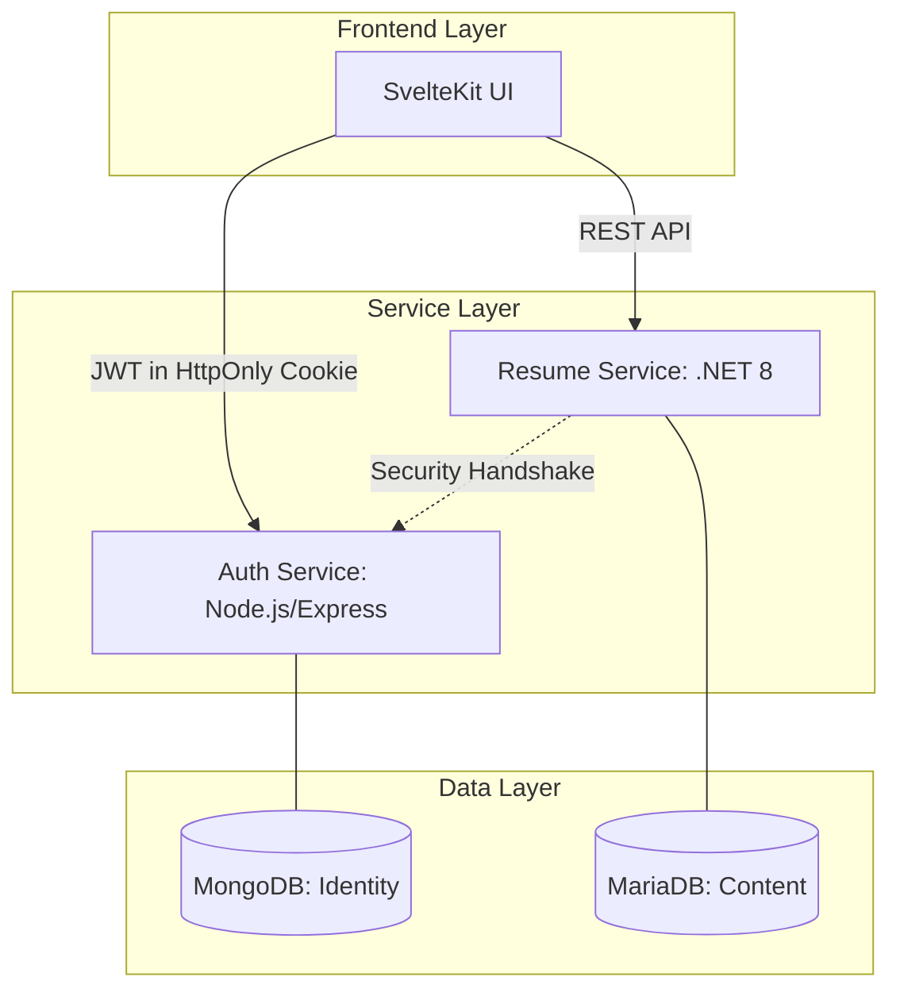

# 🚀 MyResume: Full-Stack Microservices Resume Platform

Современная экосистема для создания, управления и публикации профессиональных резюме. Проект построен на принципах микросервисной архитектуры, обеспечивая высокую масштабируемость и четкое разделение ответственности между компонентами безопасности (Node.js) и контента (.NET 8).

---

## 🏗 Архитектура системы

Проект объединяет три изолированные среды, работающие синхронно:



---

## 🔐 Безопасность и Role-Based Access Control (RBAC)

Безопасность данных — наш приоритет. Мы используем **HttpOnly Cookies** для передачи JWT, что полностью защищает токены от XSS-атак. Система прав доступа (RBAC) позволяет гибко управлять лимитами и возможностями пользователей:

### Матрица возможностей
| Возможность | Standard | Premium | Admin |
| :--- | :---: | :---: | :---: |
| Слоты для резюме | 2 | 10 | 10 |
| Экспорт в PDF (QuestPDF) | ✓ | ✓ | ✓ |
| Глобальный поиск резюме | ✗ | ✓ | ✓ |
| Модерация контента | ✗ | ✗ | ✓ |
| Смена ролей пользователей | ✗ | ✗ | ✓ |

---

## 🛠 Технический стек & Deep Dive

### **1. Identity Service (Node.js & MongoDB)**
- **Безопасность:** Хеширование паролей через `bcrypt` и двухфакторная верификация через почту.
- **Архитектура:** Использование паттерна `Error Handler wrapper` для чистых асинхронных контроллеров.

### **2. Content Service (.NET 8 & MariaDB)**
- **Performance:** Прямое использование **Dapper ORM** и хранимых процедур MySQL для минимизации накладных расходов на БД.
- **Генерация:** **QuestPDF Engine** — отрисовка документов на C# с использованием декларативного подхода (Layout-based), что в 5-10 раз быстрее традиционных HTML-to-PDF решений.

### **3. Frontend (SvelteKit)**
- **State:** Реактивная система **Svelte Stores** для мгновенного обновления UI при смене ролей.
- **Styling:** Использование современных CSS-переменных для создания гибкой дизайн-системы (Typography: Inter & Outfit).

---

## 💻 Code Showcase (Инженерные решения)

### **Frontend: Реактивное управление Auth-состоянием**
Мы создали кастомный стор, который автоматически управляет состоянием загрузки и авторизации по всему приложению:

```javascript
function createAuthStore() {
    const { subscribe, set, update } = writable({ user: null, isAuthenticated: false, isLoading: true });
    return {
        subscribe,
        setUser: (user) => set({ user, isAuthenticated: !!user, isLoading: false }),
        logout: () => set({ user: null, isAuthenticated: false, isLoading: false })
    };
}
export const auth = createAuthStore();
```

### **Backend: Хранимые процедуры через Dapper**
Для обеспечения целостности данных мы выносим сложную логику (например, создание резюме с привязкой тегов) на уровень базы данных:

```csharp
public async Task<int> CreateWithTagsAsync(CreateResumeRequest request)
{
    var result = await QuerySingleProcAsync<dynamic>(
        "sp_create_resume_with_tags",
        new { p_email = request.Email, p_pdf_data = request.PdfData, p_tag_ids = request.TagIds }
    );
    return result?.resume_id ?? 0;
}
```

### **Design: Дизайн-система на CSS-переменных**
Единый источник истины для всей типографики проекта:

```css
:root {
    --font-heading: 'Outfit', sans-serif;
    --font-body: 'Inter', sans-serif;
}

h1, h2, h3 {
    font-family: var(--font-heading);
    letter-spacing: -0.02em; /* Премиальный вид заголовков */
}
```

---

## 🚀 Быстрый старт

### Развертывание в один клик (Docker Compose)
Убедитесь, что у вас установлен Docker, и выполните:
```bash
docker-compose up --build
```
*Docker-compose автоматически поднимет MariaDB, MongoDB и все микросервисы в изолированной сети.*

---

## 📈 Будущее проекта
- [ ] Интеграция с OpenAI API для автоматической генерации "About" на основе опыта.
- [ ] Расширение палитры шаблонов PDF.
- [ ] Мобильное приложение на Svelte Native.

---
**Разработано с вниманием к деталям и любовью к качественному коду.**
