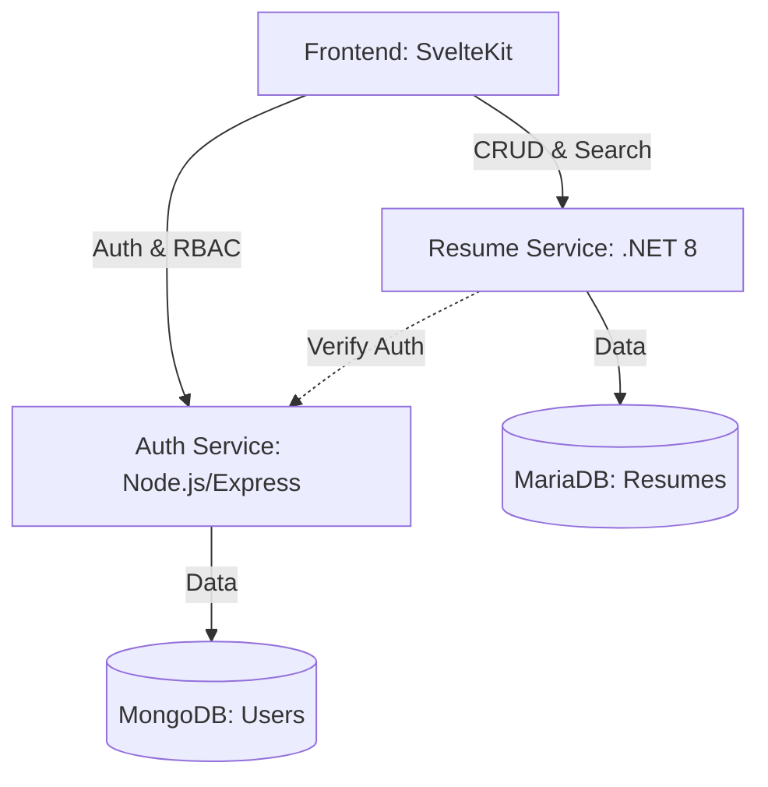

# 🚀 MyResume: Microservices Resume Platform

Современная платформа для создания и хостинга профессиональных резюме, построенная на микросервисной архитектуре. Проект объединяет мощь **.NET 8** для высокопроизводительной генерации документов и гибкость **Node.js** для управления безопасностью.

## 🏗 Архитектура системы

Проект разделен на три независимых сервиса, взаимодействующих между собой через REST API:



---

## 🛠 Технологический стек

### **Frontend**
- **Framework:** SvelteKit (реактивность и роутинг)
- **Styling:** Vanilla CSS (Custom Design System)
- **State Management:** Svelte Stores (Auth state)
- **Aesthetics:** Google Fonts (Inter & Outfit), Glassmorphism

### **Auth Service (Identity)**
- **Runtime:** Node.js (Express)
- **Database:** MongoDB (Mongoose)
- **Security:** JWT (HttpOnly Cookies), Argon2 hashing
- **Features:** Система ролей (Standard, Premium, Admin), верификация почты

### **Resume Service (Content)**
- **Runtime:** .NET 8 (C#)
- **Database:** MariaDB (Dapper ORM)
- **PDF Engine:** QuestPDF
- **Features:** Динамическая генерация PDF, поиск по тегам, разграничение приватности

---

## 🌟 Ключевые возможности

### 🔐 Ролевая модель (RBAC)
Система поддерживает три уровня доступа:
1.  **Standard:** Создание до 2-х резюме, экспорт в PDF.
2.  **Premium:** Увеличенный лимит (10 резюме), доступ к глобальному поиску и скрытым стилям.
3.  **Admin:** Все возможности Premium + инструменты модерации (удаление и просмотр всех публичных работ).

### 📄 Генерация документов
Резюме генерируются на стороне сервера в реальном времени. Мы не используем сторонние API для конвертации HTML в PDF — всё отрисовывается нативно с помощью QuestPDF, что гарантирует идеальное качество и высокую скорость.

---

## 💻 Примеры реализации

### **Backend (.NET): Декларативная генерация PDF**
Пример того, как мы описываем структуру документа без использования тяжеловесных HTML-шаблонов:

```csharp
header.Item().Text($"{data.FirstName} {data.LastName}")
    .FontSize(36)
    .Bold()
    .FontColor(Colors.Black);

// Контакты в одну строку
header.Item().PaddingTop(15).Row(contacts =>
{
    if (!string.IsNullOrWhiteSpace(data.Email))
        contacts.AutoItem().Text(data.Email);
    
    if (!string.IsNullOrWhiteSpace(data.Phone))
        contacts.AutoItem().PaddingLeft(20).Text(data.Phone);
});
```

### **Security (Node.js): middleware контроля доступа**
Защита роутов на основе ролей пользователя:

```typescript
export const requireRole = (allowedRoles: string[]) => {
  return (req: AuthRequest, res: Response, next: NextFunction) => {
    if (!req.user || !allowedRoles.includes(req.user.role)) {
      return res.status(403).json({ 
        message: "Доступ запрещен для вашей роли" 
      });
    }
    next();
  };
};
```

---

## 🚀 Быстрый старт

### Требования
- Docker & Docker Compose
- Node.js 20+
- .NET 8 SDK

### Запуск через Docker
1. Клонируйте репозиторий.
2. Выполните команду в корневой директории:
```bash
docker-compose up --build
```

### Локальная разработка
- **Frontend:** `npm run dev` в `/frontend/MyResume` (Порт 5173)
- **Auth:** `npm run dev` в `/auth-service/auth-service` (Порт 3000)
- **Resume:** `dotnet run` в `/resume_service_backend` (Порт 5052)

---

## 📝 Лицензия
Проект создан в учебных целях. Свободен для использования и модификации.
